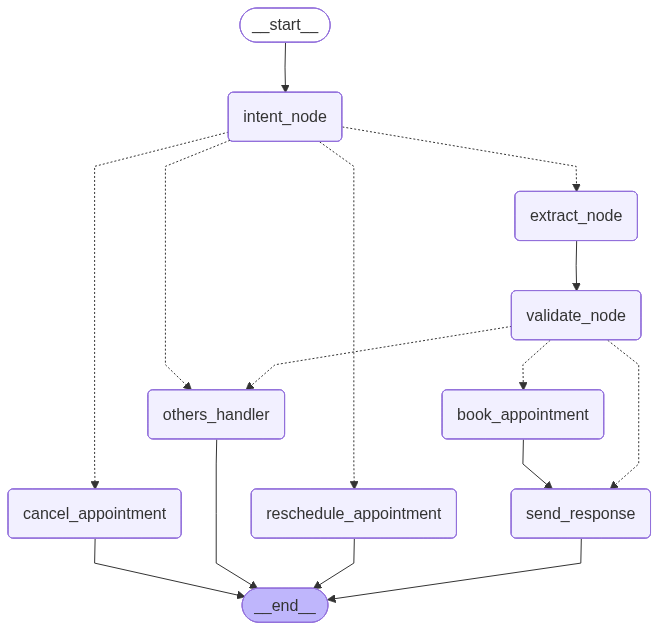

# 🌿 Haven: Your Intelligent Clinic Scheduling Assistant

[](https://fastapi.tiangolo.com/)
[](https://github.com/langchain-ai/langgraph)
[](https://www.mongodb.com/)
[](https://opensource.org/licenses/MIT)

> "Away from the documentation which was generated by AI and edited by me, my objective from the project is to build a chatbot that handles very narrow and specific task with a semi-human performance, and I am not quite there yet, but I am proud of what I have accomplished. The task was appointments processing"

# Siraj — Arabic-Native Clinic Scheduling Chatbot

> Exploring how close AI can come to a human scheduling assistant.

Built for **Fanar Hackathon 2026** by Abdelrhman Yaseen — Islamic University of Gaza.

---

## The Problem

Clinic scheduling in Arabic-speaking regions faces three core challenges:

- **Hours Wasted** — Receptionists spend hours on repetitive booking calls, limited to business hours only.
- **Language Gap** — Arabic has many dialects; even within a small area like Gaza there is significant dialectal variety.
- **No Arabic Optimization** — Existing solutions are largely optimized for English, not Arabic speakers.

---

## Why Fanar?

**Arabic is the core product.** Siraj is designed to serve patients across Egypt, Palestine, the Gulf, and the Maghreb — all with wildly different dialects. A strong native Arabic model isn't a nice-to-have; it's the foundation.

**Access without constraints.** Local models were too slow and unreliable. Paid API providers weren't accessible for free at the needed capability level. Fanar offered the required performance and speed with an OpenAI-compatible API, making integration take hours, not weeks — with zero client-side changes needed.

---

## Features & Fanar's Strengths

| Strength | Description |
|---|---|
| 🗣️ Dialect Range | Handles Egyptian, Gulf, Levantine, and Moroccan dialects in the same session without configuration |
| 🕌 Cultural Awareness | Built-in Islamic and culturally-sensitive guardrails; appropriate tone for Arabic-speaking patients |
| ⚡ OpenAI Compatible | Drop-in replacement for the OpenAI SDK |
| ✅ Extraction Quality | Entity extraction from natural language — the most critical task — rarely failed |

---

## Architecture — LangGraph State Machine

```
User → Intent Node → Extract Node → Validate Node → Book / Reschedule
                  ↘ Cancel
                  ↘ Others Handler
```

Built with **LangGraph**, **FastAPI**, **MongoDB**, and the **Fanar API**.

---

## Fanar in Action — Three Core Tasks

**1. Entity Extraction**
Maps natural language messages to structured objects (name, date, time, service) — e.g., turning "كشف طبي عند الدكتور خالد بكرة العصر" into a structured booking record.

**2. Intent Classification**
Classifies each user message into one of four intents: `Book`, `Cancel`, `Reschedule`, or `Info`.

**3. History Summarization**
Compresses multi-turn conversations into a concise context window to maintain coherence across the session.

---

## Known Limitations

- **Temporal Reasoning** — The model defaults to year 2023 when no year is specified. Workaround: parse and inject the current date before sending to the model.
- **Multi-Turn Intent** — Providing the last 3 messages as context noticeably reduces intent classification accuracy. Still being investigated.
- **Islamic Phrase Confusion** — Common phrases like "يالله" in a scheduling context can confuse the model. Discovered late; being avoided in demos for now.
- **Over-Sensitive Guardrails** — Mild frustration phrases from users trigger safety refusals, breaking conversation flow.

---

## Getting Started

```bash
git clone https://github.com/AbedrahmanYassen/clinic_scheduling_agent
cd clinic_scheduling_agent
```

> See the repo for full setup instructions and environment configuration.

---

*Fanar Hackathon 2026 — Islamic University of Gaza*

### Node Responsibilities:

| Node | Responsibility |
|------|-----------------|
| **Intent Node** | Classify user intent (book/cancel/reschedule/appointment_info/info) via LLM |
| **Extract Node** | Extract appointment entities (name, date, time, service) with Pydantic validation |
| **Validate Node** | Check for missing fields, request clarifications, merge with conversation memory |
| **Book Appointment** | Create reservation, check conflicts, sync with Google Calendar |
| **Reschedule Appointment** | Modify existing appointment or suggest alternatives |
| **Cancel Appointment** | Remove appointment from database and calendar |
| **Others Handler** | Handle out-of-scope requests or info queries |
| **Send Response** | Format final response with appointment details and status |

### Conversation Memory:
- Extracts entities from each user message
- Merges with prior context (user doesn't repeat name/date across turns)
- Enables natural multi-turn conversations
---


## 🛠️ Tech Stack

- **Backend**: Python 3.13, FastAPI (async web framework)
- **Agent Framework**: LangGraph 1.1.10 (state machine orchestration), LangChain (LLM abstraction)
- **AI Models**: 
  - Google Gemini (gemini-2.5-flash-lite) — Cloud-based, high capability
  - Fanar — Arabic-specialized LLM via API
- **Database**: MongoDB with Motor (async driver)
- **Observability**: LangFuse for LLM call tracing and monitoring
- **Configuration**: Pydantic Settings for environment management
- **Frontend**: HTML/CSS/JavaScript (static)

---

## 🚀 Getting Started

### Prerequisites
- Python 3.13+
- MongoDB instance (Local or Atlas)
- (Optional) API keys for preferred LLM provider:
  - Fanar: `Fanar_API_KEY`
- (Optional) LangFuse account for observability

### Installation

1. **Clone the repository**:
   ```bash
   git clone https://github.com/your-username/clinic-scheduling-chatbot.git
   cd clinic-scheduling-chatbot
   ```

2. **Set up virtual environment**:
   ```bash
   uv venv
   source .venv/bin/activate  # On Windows: .venv\Scripts\activate
   ```

3. **Install dependencies**:
   ```bash
   uv sync
   ```

4. **Configure Environment Variables**:
   Create a `.env` file in the root directory:
   ```env
   PROJECT_NAME="Haven"
   MODEL_PROVIDER="Fanar"  # Options: "Gemini", "Fanar", or "Ollama"
    
   # LLM Configuration (choose one provider)
   Fanar_API_KEY="your_fanar_key_here"
   # OR
   GEMINI_API_KEY="your_gemini_key_here"
   GEMINI_MODEL_NAME="gemini-2.5-flash-lite"
    
   # Database
   MONGODB_URL="mongodb://localhost:27017"
   DATABASE_NAME="haven_db"
    
   # Observability
   LANGFUSE_PUBLIC_KEY="pk-..."
   LANGFUSE_SECRET_KEY="sk-..."
   LANGFUSE_BASE_URL="https://cloud.langfuse.com"
    
   # Other Settings
   TIME_ZONE="Asia/Gaza"
   SESSION_SECRET_KEY="change-this-in-production"
   Electricity_Off=False  # Set to True for offline/mock mode
   ```

### Running the Application

Start the FastAPI server:
```bash
uvicorn app.main:app --reload
```
Open your browser and navigate to `http://localhost:8000/api/v1` to start chatting with Haven!

---

## 🔄 How Haven Works: Example Conversation

```
User: "أريد حجز موعد غدا في الساعة 2"
→ Intent Node classifies: "book"
→ Extract Node pulls: name=None, date="غدا", time="14:00", service=None
→ Validate Node detects: missing name
→ Send Response: "عذرا، ما اسمك؟"

User: "اسمي أحمد"
→ Intent Node classifies: "info" (providing information)
→ Extract Node pulls: name="أحمد", date=None, time=None
→ Conversation Memory merges: name="أحمد" (new) + date="غدا", time="14:00" (from memory)
→ Validate Node: All fields complete ✅
→ Book Appointment Node: Creates reservation in MongoDB + Google Calendar
→ Send Response: "تم حجز موعدك يوم غدا الساعة 14:00. رقم التأكيد: #12345"
```

---

## 📚 API Endpoints

### POST `/api/v1/chat`
Send a message and get response with appointment status.

**Request**:
```json
{
  "session_id": "user-123",
  "user_message": "أريد حجز موعد"
}
```

**Response**:
```json
{
  "response": "عذرا، ما اسمك؟",
  "entities": {
    "name": null,
    "date": null,
    "time": null,
    "service": "عام"
  },
  "status": "missing_info",
  "missing_fields": ["name"]
}
```

### GET `/`
Serves the web UI for chatting with Haven.

---


### Services Architecture

```
FastAPI Router
    ↓
SchedulingAgentService
    ├─→ LLMService (Fanar)
    ├─→ ReservationService (MongoDB)
    ├─→ ConversationMemoryService
    └─→ LangGraph Agent (state machine)
```

### Database Schema

**Reservations Collection**:
```json
{
  "_id": ObjectId,
  "session_id": "user-123",
  "name": "أحمد",
  "date": "2026-06-21",
  "time": "14:00",
  "service": "عام",
  "start_time": ISODate("2026-06-21T14:00:00Z"),
  "end_time": ISODate("2026-06-21T14:30:00Z"),
  "created_at": ISODate,
  "status": "confirmed"
}
```

**Conversation History Collection**:
```json
{
  "_id": ObjectId,
  "session_id": "user-123",
  "messages": [
    {"role": "user", "content": "أريد حجز موعد"},
    {"role": "assistant", "content": "عذرا، ما اسمك؟"}
  ],
  "updated_at": ISODate
}
```

---

## 🚀 Performance & Scalability

| Metric | Value |
|--------|-------|
| **Intent Classification Latency** | ~500ms (LLM-based) |
| **Entity Extraction Latency** | ~800ms (LLM + validation) |
| **End-to-End Latency** | ~2s (LLM + DB + Calendar) |
| **Concurrent Users Supported** | 100+ (tested), 1000+ (with load balancing) |
| **Appointments per Day** | Unlimited (depends on MongoDB capacity) |


## ⚠️ Known Limitations & Future Work

| Issue | Status | Planned Fix |
|-------|--------|-------------|
| **Error Messages** | 🟡 Generic Arabic | More context-specific responses |
| **Multi-Language Support** | ❌ Arabic only | Plan to add English |
| **SMS/Email Reminders** | ❌ Not implemented |


